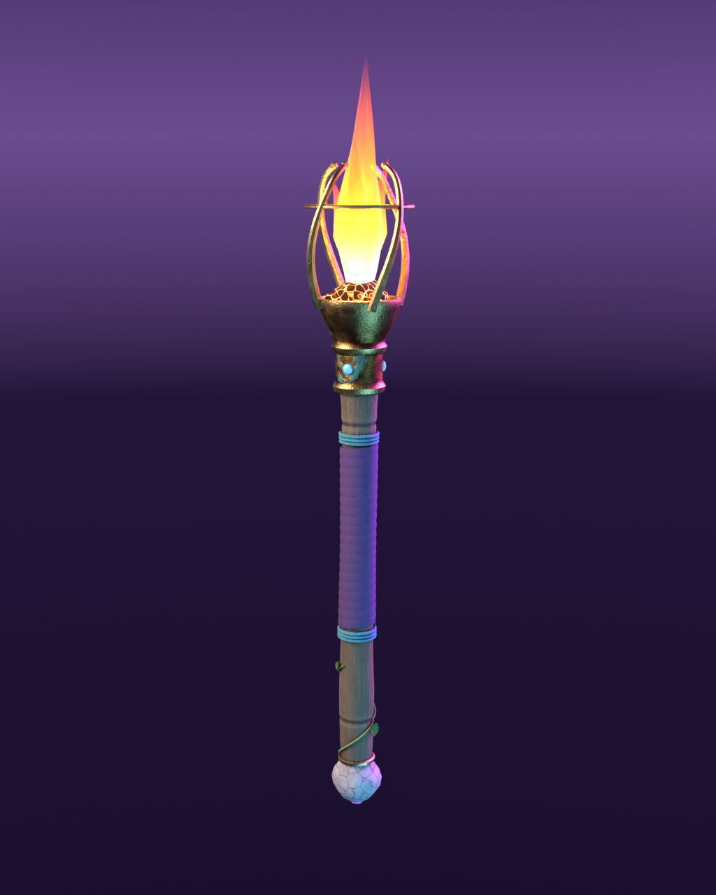

# Torch — Beyond Euclid held item



An old-timber torch: a hand-whittled octagonal grip wrapped in deep-violet leather with cyan thread bindings, a pale carved-bone pommel set with a violet cabochon, and a sprig of ivy creeping up from the butt. A hammered bronze collar with verdigris patina and three cyan inlays holds a bowl of cracked embers. Four prongs twist as they rise, tied together by a thin halo. The flame is amber, with a cyan gas base and a violet tip.

Close-ups: `preview_detail.png` (cradle/flame), `preview_grip.png` (grip/ivy).

## Files

| Path | What |
| --- | --- |
| `public/models/torch/torch.glb` | Shipped asset, all textures embedded as PNG (5.5 MiB) |
| `assets/torch/build_torch.py` | Full modelling + texture bake + export source (deterministic) |
| `assets/torch/torch.blend` | Editable scene saved by the build (final materials; bake-source materials kept as fake users `SRC_*`) |
| `assets/torch/textures/*.png` | Texture sources embedded in the GLB |
| `assets/torch/textures/bake_src/*.png` | Unpacked roughness / metalness / AO bakes used to build the ORM |
| `assets/torch/render_preview.py` | Imports the **GLB** into a clean scene and renders the previews offline (Cycles) |
| `assets/torch/validate_glb.py` | Stdlib GLB structure check (names, bounds, embedded PNGs, tri count) |

## Dimensions, origin, orientation

- glTF space: **+Y up**, metres. Flame points along +Y.
- Origin `(0,0,0)` = centre of the leather-wrapped hand zone (wrap spans Y −0.104 … +0.104).
- Bounds: X −0.059…0.062, **Y −0.323…0.530 (0.853 m long)**, Z −0.061…0.061.
- The front cyan inlay on the collar faces **+Z** (toward a first-person camera looking down −Z). The grip has a ≤2 mm deliberate crook in X/Z, so the item is not perfectly axisymmetric.

Landmarks (glTF Y):

| Part | Y |
| --- | --- |
| Pommel bottom / violet gem | −0.323 |
| Leather wrap (hand zone) | −0.104 … +0.104 |
| Bronze collar + cyan inlays | 0.160 … 0.220 (inlays at 0.190) |
| Bronze bowl | 0.220 … 0.264 |
| Bowl lip | 0.264 |
| Ember lump centre | ≈ 0.262 |
| Prong tips | ≈ 0.40 |
| Flame (outer) | 0.255 … 0.530 |
| Flame core | 0.262 … 0.405 |

## Node / mesh / material names

```
Torch                       (root empty, identity transform)
├─ Torch_Body               mesh, M_Torch_Body      13,344 tris — grip, wrap, bindings, pommel, collar, cradle, inlays, ivy
├─ Torch_Ember              mesh, M_Torch_Ember        580 tris — glowing coals in the bowl
├─ Torch_Flame              mesh, M_Torch_Flame      3,128 tris — outer flame: main tongue + 3 side tongues (alpha BLEND)
├─ Torch_FlameCore          mesh, M_Torch_FlameCore    416 tris — opaque hot inner core
└─ Torch_Emitter            empty at (0.0015, 0.330, 0.0001) — point-light anchor
                             extras: { role: "light-emitter", color: "#ffb45e" }
```

Total **17,468 triangles**. All mesh nodes have identity transforms (vertices are already in torch space), so `Torch_Emitter.position` is the light position in the torch's local frame.

### Emission / flicker hooks

| Material | Emissive map | `emissiveIntensity` (KHR_materials_emissive_strength) | Notes |
| --- | --- | --- | --- |
| `M_Torch_Body` | `Torch_Body_Emissive` (only the cyan/violet inlays, at 45 %) | 1 | Raise to make the inlays pulse |
| `M_Torch_Ember` | `Torch_Ember_Emissive` (crack glow) | 4 | Good flicker target |
| `M_Torch_Flame` | same texture as base colour | 1.2 | `alphaMode: BLEND`; in three.js consider `depthWrite = false` and optionally `AdditiveBlending` |
| `M_Torch_FlameCore` | same texture as base colour | 2.0 | Opaque |

For flicker, scale `Torch_Flame` / `Torch_FlameCore` non-uniformly about Y ≈ 0.26 (their bases sit inside the ember), jitter `emissiveIntensity`, and drive the point light from `Torch_Emitter`. The existing lamp light colour `0xffb45e` matches the flame.

## Textures

| Texture | Size | Colour space | glTF slot |
| --- | --- | --- | --- |
| `Torch_Body_BaseColor.png` | 1024² | sRGB | baseColor (AO/cavity painted in) |
| `Torch_Body_ORM.png` | 1024² | linear | R occlusion · G roughness · B metalness |
| `Torch_Body_Normal.png` | 1024² | linear | tangent-space normal (OpenGL / +Y) |
| `Torch_Body_Emissive.png` | 1024² | sRGB | emissive |
| `Torch_Ember_BaseColor/Emissive/Normal.png` | 512² | sRGB / sRGB / linear | ember |
| `Torch_Flame.png` | 256×512 RGBA | sRGB | flame base colour + alpha + emissive (V = height) |
| `Torch_FlameCore.png` | 256×512 | sRGB | core base colour + emissive |

The body textures are baked in Cycles from procedural "painted" materials (wood grain lines, silvered weathering, edge wear from pointiness, cavity AO, bronze verdigris, leather pores, cracked bone). The flame gradients are painted in numpy. No tangents are exported; three.js derives them.

**Size budget:** most of the 5.5 MiB is the noisy 1024² PNGs (the normal map alone is 1.8 MiB). If load time matters, re-export with `export_image_format='WEBP'` in `build_torch.py` (three.js `GLTFLoader` supports `EXT_texture_webp`), or drop the body textures to 512².

## Regenerating

From the repo root, with Blender 5.2 LTS (`/Applications/Blender.app`):

```sh
# Rebuilds meshes, bakes textures (~2.5 min CPU), writes textures/, torch.blend and the GLB
/Applications/Blender.app/Contents/MacOS/Blender -b --factory-startup --python assets/torch/build_torch.py

# Renders preview*.png from the exported GLB (TORCH_SAMPLES=48 for a quick pass, default 160)
/Applications/Blender.app/Contents/MacOS/Blender -b --factory-startup --python assets/torch/render_preview.py

# Structural check
python3 assets/torch/validate_glb.py
```

Tweakables are at the top of `build_torch.py` (`BODY_TEX`, `EMBER_TEX`, `EMITTER_Z`, `BAKE_SAMPLES`); colours live in the `src_*` material builders and the `flame_texture(...)` calls in `main()`. Geometry is modelled in Blender Z-up; the exporter converts to glTF Y-up (`Blender (x, y, z) → glTF (x, z, −y)`).

Previews use the Standard view transform (closer to three.js sRGB output than AgX, which washes the flame to pink).
